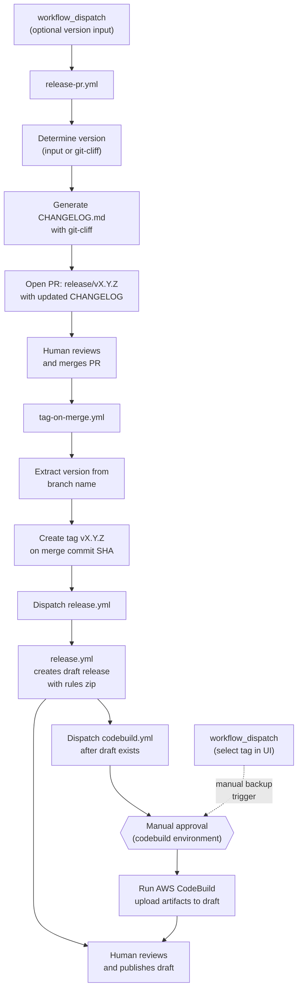
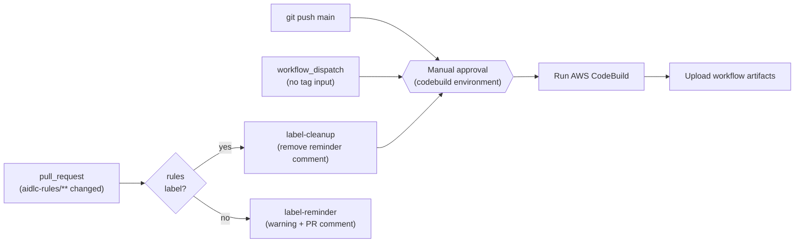
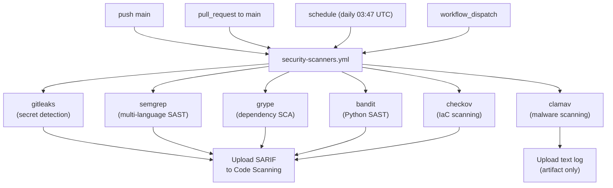
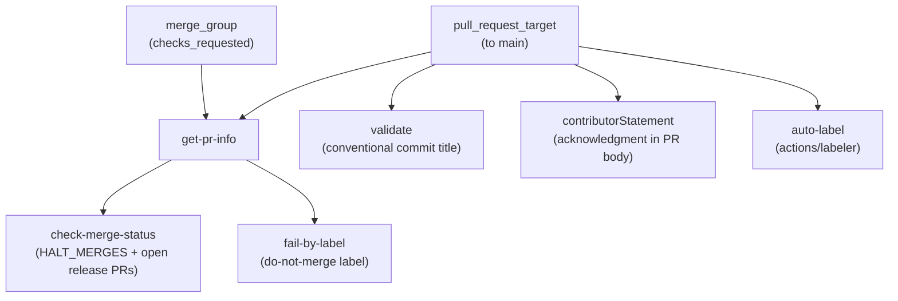

# Administrative Guide

This guide documents the CI/CD infrastructure, GitHub Workflows, protected environments, secrets, variables, permissions, and release process for the `awslabs/aidlc-workflows` repository.

**Audience:** Repository administrators, maintainers, and AI coding agents working on this repository.

**Related documentation:**
- [Developer's Guide](DEVELOPERS_GUIDE.md) — Running builds locally (CodeBuild + `act`)
- [Contributing Guidelines](../CONTRIBUTING.md) — Contribution process and conventions
- [README](../README.md) — User-facing setup and usage

---

## Table of Contents

- [Repository Overview](#repository-overview)
- [CI/CD Architecture](#cicd-architecture)
- [Workflow Reference](#workflow-reference)
  - [Release PR Workflow](#release-pr-workflow-release-pryml)
  - [Tag Release Workflow](#tag-release-workflow-tag-on-mergeyml)
  - [CodeBuild Workflow](#codebuild-workflow-codebuildyml)
  - [Release Workflow](#release-workflow-releaseyml)
  - [Pull Request Validation Workflow](#pull-request-validation-workflow-pull-request-lintyml)
  - [Security Scanners Workflow](#security-scanners-workflow-security-scannersyml)
- [Protected Environments](#protected-environments)
- [Secrets and Variables](#secrets-and-variables)
- [Permissions Model](#permissions-model)
- [Security Posture](#security-posture)
  - [Security Finding Requirements](#security-finding-requirements)
- [Code Ownership](#code-ownership)
- [Release Process](#release-process)
- [Changelog Configuration](#changelog-configuration)
- [Updating Pinned Versions](#updating-pinned-versions)

---

## Repository Overview

This repository publishes the **AI-DLC (AI-Driven Development Life Cycle)** methodology as a set of markdown rule files under `aidlc-rules/`. The CI/CD infrastructure handles:

- **Continuous integration** via AWS CodeBuild (evaluation and reporting)
- **Release distribution** via GitHub Releases (zipped rule files)
- **Changelog generation** via git-cliff (changelog-first: updated before release, included in the tagged commit)

```
awslabs/aidlc-workflows/
├── .github/
│   ├── CODEOWNERS
│   ├── ISSUE_TEMPLATE/           # Bug, feature, RFC, docs templates
│   ├── labeler.yml               # Auto-label rules (path → label mapping)
│   ├── pull_request_template.md  # PR template with contributor statement
│   └── workflows/
│       ├── codebuild.yml         # CI via AWS CodeBuild
│       ├── pull-request-lint.yml # PR validation (title, labels, merge gates)
│       ├── release.yml           # GitHub Release on tag push
│       ├── release-pr.yml        # Changelog PR before release
│       ├── security-scanners.yml # Security scanning suite (6 scanners)
│       └── tag-on-merge.yml      # Auto-tag on release PR merge
├── .claude/
│   └── settings.json             # Shared Claude Code project settings
├── aidlc-rules/                  # The distributable product
│   ├── aws-aidlc-rules/          # Core workflow rules
│   └── aws-aidlc-rule-details/   # Detailed rules by phase
├── cliff.toml                    # git-cliff changelog configuration
├── docs/
│   ├── ADMINISTRATIVE_GUIDE.md   # This file
│   └── DEVELOPERS_GUIDE.md       # Local build instructions
└── scripts/
    └── aidlc-evaluator/          # Evaluation framework (in development)
```

---

## CI/CD Architecture

Six workflows form two distinct pipelines, a security scanning suite, plus a pull request validation gate:

### Pipeline 1: Release (changelog-first)



The release flow is **changelog-first**: the CHANGELOG is updated *before* the tag is created, so the tagged commit always contains its own changelog entry. The flow has three human touchpoints:

1. **Merge the release PR** — reviews the changelog, triggers automatic tagging
2. **Approve the CodeBuild environment** — gates access to AWS credentials for the build
3. **Publish the draft release** — reviews artifacts, makes the release public

`tag-on-merge.yml` explicitly dispatches `release.yml` and `codebuild.yml` via `gh workflow run --ref vX.Y.Z` after creating the tag. The dispatches are **sequential**: `release.yml` runs first and is watched to completion so that the draft release exists before `codebuild.yml` uploads artifacts. This is necessary because tags created with `GITHUB_TOKEN` do not trigger `on: push: tags` events — but `workflow_dispatch` is exempt from this limitation. Both workflows also retain `push: tags: v*` as a fallback for manual tag pushes. The `codebuild.yml` workflow requires **manual approval** via the `codebuild` protected environment before the build proceeds. The upload step handles all release states resiliently:
- **Draft exists** (normal case) — `release.yml` finishes in ~30s creating the draft; CodeBuild takes minutes, so the draft is ready when artifacts are uploaded
- **No release yet** (codebuild finished first) — creates a draft with build artifacts; `release.yml` will update it later
- **Already published** (re-run) — attempts to replace artifacts, warns gracefully if immutable

**Backup strategy:** If the tag-triggered CodeBuild run fails or is blocked, an admin can manually dispatch the workflow via `workflow_dispatch` and select the `v*` tag in the GitHub UI branch/tag selector. Since `github.ref` resolves to the selected tag, the upload step activates automatically.

### Pipeline 2: Continuous Integration



### Pipeline 3: Security Scanning



All six scanner jobs run in parallel. Each scanner (except ClamAV) produces a SARIF report uploaded to both GitHub Code Scanning (Security tab) and as a downloadable workflow artifact. All scanners use a **deferred-failure pattern**: the scan runs to completion, results are always uploaded, and only then does the job fail if findings exceed the configured threshold. See the [Security Scanners Workflow](#security-scanners-workflow-security-scannersyml) reference for details.

### Pipeline 4: Pull Request Validation



`pull-request-lint.yml` runs on every PR targeting `main` and on merge queue checks. It enforces four gates (conventional commit PR titles, the contributor statement from the PR template, a configurable merge-halt mechanism, and a do-not-merge label check) and automatically applies labels based on changed file paths. The workflow uses `pull_request_target` (not `pull_request`) so it runs in the context of the base branch — this is safe because it never checks out PR code and the `auto-label` job uses `actions/labeler` which only reads file paths from the API.

---

## Workflow Reference

### Release PR Workflow (`release-pr.yml`)

| Property        | Value                                             |
| --------------- | ------------------------------------------------- |
| **File**        | `.github/workflows/release-pr.yml`                |
| **Trigger**     | `workflow_dispatch` with optional `version` input |
| **Environment** | _(none)_                                          |
| **Runner**      | `ubuntu-latest`                                   |

**Purpose:** Generates an updated `CHANGELOG.md` from conventional commits using git-cliff, writes the release version to `aidlc-rules/VERSION`, and opens a PR on a `release/vX.Y.Z` branch. This is the first step in the changelog-first release flow. The `aidlc-rules/VERSION` update ensures the PR touches `aidlc-rules/`, which triggers the `codebuild.yml` path filter and the `rules` auto-label.

**Job: `release-pr` ("Create Release PR")**

| Step | Name                     | Action                                                                                                                                     |
| ---- | ------------------------ | ------------------------------------------------------------------------------------------------------------------------------------------ |
| 1    | Checkout code            | `actions/checkout` with `fetch-depth: 0` (full history for git-cliff)                                                                      |
| 2    | Install git-cliff        | `orhun/git-cliff-action` to make the CLI available                                                                                         |
| 3    | Determine version        | Use `inputs.version` (with semver validation) or `git-cliff --bumped-version` for auto-detection; falls back to patch bump from latest tag |
| 4    | Check tag does not exist | Fail early if the target tag already exists                                                                                                |
| 5    | Generate changelog       | `orhun/git-cliff-action` with `--tag vX.Y.Z` to generate `CHANGELOG.md`                                                                    |
| 6    | Create release PR        | Write version to `aidlc-rules/VERSION`, check branch doesn't already exist, commit, push `release/vX.Y.Z` branch, open PR (with labels `release` and `rules` if they exist in the repo) |

**Version detection:** If a version is specified, it must be valid semver (`MAJOR.MINOR.PATCH`); both `v0.2.0` and `0.2.0` are accepted. If no version is specified, `git-cliff --bumped-version` determines the next version from conventional commit prefixes. The `[bump]` config in `cliff.toml` controls the rules (e.g., `feat` → minor bump, breaking change → major bump). If no conventional commits are found, the workflow falls back to a patch bump from the latest tag. If no tags exist at all, it exits cleanly with a warning (no PR is created).

**External actions (SHA-pinned):**

| Action                   | Version | SHA                                        |
| ------------------------ | ------- | ------------------------------------------ |
| `actions/checkout`       | v6.0.1  | `8e8c483db84b4bee98b60c0593521ed34d9990e8` |
| `orhun/git-cliff-action` | v4.7.0  | `e16f179f0be49ecdfe63753837f20b9531642772` |

---

### Tag Release Workflow (`tag-on-merge.yml`)

| Property        | Value                                                 |
| --------------- | ----------------------------------------------------- |
| **File**        | `.github/workflows/tag-on-merge.yml`                  |
| **Trigger**     | `pull_request: types: [closed]`                       |
| **Condition**   | PR was merged AND branch name starts with `release/v` |
| **Environment** | _(none)_                                              |
| **Runner**      | `ubuntu-latest`                                       |

**Purpose:** Automatically creates a version tag on the merge commit when a release PR is merged, then dispatches `release.yml` (waits for completion) followed by `codebuild.yml`.

**Job: `tag` ("Create Release Tag")**

| Step | Name                               | Action                                                                                      |
| ---- | ---------------------------------- | ------------------------------------------------------------------------------------------- |
| 1    | Create tag                         | Extract version from branch name, verify tag doesn't exist, create via GitHub API           |
| 2    | Dispatch release workflow and wait | `gh workflow run release.yml --ref $TAG --repo $REPO`, then `gh run watch` until completion |
| 3    | Dispatch codebuild workflow        | `gh workflow run codebuild.yml --ref $TAG --repo $REPO` (runs after draft release exists)   |

**Tag creation:** Uses `gh api repos/.../git/refs` to create a lightweight tag.

**Workflow dispatch:** Tags created with `GITHUB_TOKEN` do not trigger `on: push: tags` events in other workflows. To work around this, `tag-on-merge.yml` explicitly dispatches `release.yml` and `codebuild.yml` via `gh workflow run --ref $TAG`. The `workflow_dispatch` event is exempt from this `GITHUB_TOKEN` limitation. Since `--ref` is set to the tag, both dispatched workflows see `github.ref = refs/tags/vX.Y.Z` — identical to a real tag push. The dispatches are **sequential**: `release.yml` runs first (watched via `gh run watch`) to ensure the draft release exists before `codebuild.yml` attempts to upload artifacts. If the release run cannot be found or fails, `codebuild.yml` is dispatched anyway as a fallback.

**Security:** The branch name `release/vX.Y.Z` is passed through an environment variable (not directly interpolated) to prevent command injection. The job-level `if` condition uses `github.event.pull_request.merged == true` to ensure only merged PRs trigger tagging.

---

### CodeBuild Workflow (`codebuild.yml`)

| Property        | Value                                                                                                                                                    |
| --------------- | -------------------------------------------------------------------------------------------------------------------------------------------------------- |
| **File**        | `.github/workflows/codebuild.yml`                                                                                                                        |
| **Triggers**    | `push` to `main`, `push` tags `v*`, `pull_request` to `main` (label-gated, path-filtered), `workflow_dispatch` (dispatched by `tag-on-merge.yml` or manual — select a tag in the UI to trigger a release build) |
| **Environment** | `codebuild` (protected, manual approval)                                                                                                                 |
| **Runner**      | `ubuntu-latest`                                                                                                                                          |
| **Concurrency** | Groups by `{workflow}-{ref}`, cancels in-progress                                                                                                        |

**Purpose:** Runs an AWS CodeBuild project, downloads primary and secondary artifacts from S3, caches them in GitHub Actions cache, uploads them as workflow artifacts, and (when triggered from a `v*` tag) attaches them to the GitHub Release.

**PR label gate:** For `pull_request` events, the workflow only fires when files under `aidlc-rules/**` are changed (via `paths` filter) and the `build` job only runs when the `rules` label is present on the PR (via `contains(github.event.pull_request.labels.*.name, 'rules')`). The `rules` label is applied automatically by the `auto-label` job in `pull-request-lint.yml` (see [Pull Request Validation Workflow](#pull-request-validation-workflow-pull-request-lintyml)). The trigger includes `types: [opened, synchronize, reopened, labeled]` so that subsequent pushes to a labeled PR re-trigger the build automatically. `push`, `workflow_dispatch`, and tag events bypass the label check entirely.

**Job: `label-reminder`** (PR only, no `rules` label)

| Step | Name                             | Action                                                                                     |
| ---- | -------------------------------- | ------------------------------------------------------------------------------------------ |
| 1    | Warn about missing rules label   | Emits a `::warning::` annotation visible in the Actions summary                           |
| 2    | Comment on PR                    | Posts a one-time PR comment (idempotent — skips if the reminder comment already exists)     |

This job runs only for `pull_request` events where `aidlc-rules/**` changed but the `rules` label is absent. It alerts maintainers and reviewers that the evaluation pipeline was not triggered. The comment is posted once per PR using an HTML comment marker (`<!-- rules-label-reminder -->`) to avoid duplicates. In normal operation, the `auto-label` job in `pull-request-lint.yml` applies the `rules` label automatically, so this job serves as a fallback safety net.

**Job: `label-cleanup`** (PR only, `rules` label present)

| Step | Name                          | Action                                                                                   |
| ---- | ----------------------------- | ---------------------------------------------------------------------------------------- |
| 1    | Remove label reminder comment | Finds and deletes the `label-reminder` PR comment (no-op if it doesn't exist)            |

This job runs when the `rules` label is applied, immediately removing the reminder comment without waiting for the `codebuild` environment approval gate.

**Job: `build`**

| Step | Name                         | Condition                 | Action                                                        |
| ---- | ---------------------------- | ------------------------- | ------------------------------------------------------------- |
| 1    | List caches                  | _(always)_                | `gh cache list` for existing project caches                   |
| 2    | Check cache                  | _(always)_                | `actions/cache/restore` with `lookup-only: true`              |
| 3    | Configure AWS credentials    | cache miss                | `aws-actions/configure-aws-credentials` (OIDC)                |
| 4    | Run CodeBuild                | cache miss                | `aws-actions/aws-codebuild-run-build` with inline buildspec   |
| 5    | Build ID                     | cache miss (always)       | Echo CodeBuild build ID                                       |
| 6    | Download CodeBuild artifacts | cache miss                | Download primary + secondary artifacts from S3                |
| 7    | List CodeBuild artifacts     | cache miss                | List and inspect downloaded zip files                         |
| 8    | Clean old report caches      | cache miss                | Delete 3 oldest matching caches for branch                    |
| 9    | Save report to cache         | cache miss                | `actions/cache/save` with key `{project}-{branch}-{sha}`      |
| 10   | Upload primary artifact      | `!env.ACT`                | `actions/upload-artifact` for `{project}.zip`                 |
| 11   | Upload evaluation artifact   | `!env.ACT`                | `actions/upload-artifact` for `evaluation.zip`                |
| 12   | Upload trend artifact        | `!env.ACT`                | `actions/upload-artifact` for `trend.zip`                     |
| 13   | Upload artifacts to release  | triggered from a `v*` tag | Attach build artifacts to GitHub Release (draft or published) |

**Caching strategy:** The cache key `{project}-{branch}-{sha}` ensures that the same commit on the same branch is never built twice. On cache hit, steps 3–9 are skipped entirely.

**Inline buildspec:** The workflow embeds a full `buildspec-override` rather than referencing an external file. The buildspec:
- Installs `gh` CLI (via dnf) and `uv` (Python package manager)
- Determines build context: release (tagged), pre-release (default branch), or pre-merge (feature branch)
- Creates placeholder evaluation and trend report files under `.codebuild/`
- Outputs a primary artifact (all files under `.codebuild/`) and two secondary artifacts (`evaluation`, `trend`)

**Artifact upload compatibility:** Upload steps are gated by `!env.ACT` because `actions/upload-artifact` v6 is incompatible with the [`act`](https://github.com/nektos/act) local runner.

**External actions (all SHA-pinned):**

| Action                                  | Version | SHA                                        |
| --------------------------------------- | ------- | ------------------------------------------ |
| `actions/cache/restore`                 | v5.0.3  | `cdf6c1fa76f9f475f3d7449005a359c84ca0f306` |
| `aws-actions/configure-aws-credentials` | v6.0.0  | `8df5847569e6427dd6c4fb1cf565c83acfa8afa7` |
| `aws-actions/aws-codebuild-run-build`   | v1.0.18 | `d8279f349f3b1b84e834c30e47c20dcb8888b7e5` |
| `actions/cache/save`                    | v5.0.3  | `cdf6c1fa76f9f475f3d7449005a359c84ca0f306` |
| `actions/upload-artifact`               | v6.0.0  | `b7c566a772e6b6bfb58ed0dc250532a479d7789f` |

---

### Release Workflow (`release.yml`)

| Property        | Value                                                                                                                 |
| --------------- | --------------------------------------------------------------------------------------------------------------------- |
| **File**        | `.github/workflows/release.yml`                                                                                       |
| **Triggers**    | `workflow_dispatch` (dispatched by `tag-on-merge.yml`), `push` on tags matching `v*` (fallback for manual tag pushes) |
| **Environment** | _(none)_                                                                                                              |
| **Runner**      | `ubuntu-latest`                                                                                                       |

**Purpose:** Creates a **draft** GitHub Release with a zip of `aidlc-rules/` when dispatched or when a version tag is pushed. The release is kept as a draft so that CodeBuild artifacts can be attached and reviewed before publishing.

**Job: `release` ("Create Release")**

| Step | Name                    | Condition         | Action                                                                                                                                              |
| ---- | ----------------------- | ----------------- | --------------------------------------------------------------------------------------------------------------------------------------------------- |
| 1    | Checkout code           | _(always)_        | `actions/checkout` with `fetch-depth: 0`                                                                                                            |
| 2    | Extract version         | _(always)_        | Guard: if `GITHUB_REF` is not a `v*` tag, emit `::warning::` and skip remaining steps. Otherwise parse into `version` (no `v`) and `tag` (with `v`) |
| 3    | Create release artifact | ref is a `v*` tag | `zip -r ai-dlc-rules-v{VERSION}.zip aidlc-rules/`                                                                                                   |
| 4    | Create GitHub Release   | ref is a `v*` tag | `softprops/action-gh-release` with `draft: true` and zip attached                                                                                   |

**Graceful skip:** If dispatched from a branch instead of a tag (e.g., someone manually runs the workflow from `main`), the job completes successfully with a warning annotation rather than failing. This prevents confusing red X failures in the Actions UI.

**Release naming:** `AI-DLC Workflow v{VERSION}` (e.g., `AI-DLC Workflow v0.1.6`)

**External actions (SHA-pinned):**

| Action                        | Version | SHA                                        |
| ----------------------------- | ------- | ------------------------------------------ |
| `actions/checkout`            | v6.0.1  | `8e8c483db84b4bee98b60c0593521ed34d9990e8` |
| `softprops/action-gh-release` | v2.5.0  | `a06a81a03ee405af7f2048a818ed3f03bbf83c7b` |

---

### Pull Request Validation Workflow (`pull-request-lint.yml`)

| Property        | Value                                                                                            |
| --------------- | ------------------------------------------------------------------------------------------------ |
| **File**        | `.github/workflows/pull-request-lint.yml`                                                        |
| **Triggers**    | `pull_request_target` to `main` (edited, labeled, opened, ready_for_review, reopened, synchronize, unlabeled); `merge_group` (checks_requested) |
| **Environment** | _(none)_                                                                                         |
| **Runner**      | `ubuntu-latest`                                                                                  |
| **Concurrency** | Groups by `{workflow}-{ref}`, cancels in-progress                                                |

**Purpose:** Validates pull requests before merge. Enforces conventional commit PR titles, the contributor acknowledgment statement, merge-halt controls, and a do-not-merge label gate. Also runs as a merge queue check.

**Why `pull_request_target`:** This trigger runs the workflow in the context of the base branch (not the PR head). This is safe here because no step checks out or executes PR code — the workflow only inspects PR metadata (title, labels, body). Using `pull_request_target` ensures the workflow has access to repository secrets and labels even for PRs from forks.

**Job: `get-pr-info`**

| Step | Name        | Action                                                                                                   |
| ---- | ----------- | -------------------------------------------------------------------------------------------------------- |
| 1    | Get PR info | Extract PR number and labels from event context (`pull_request_target`) or by API lookup (`merge_group`) |

Outputs `pr_number` and `pr_labels` for downstream jobs. For `merge_group` events, the PR number is extracted from the ref name and labels are fetched via the GitHub API. For `pull_request_target` events, values come directly from the event payload.

**Job: `check-merge-status` ("Check Merge Status")**

Depends on `get-pr-info`. Runs `if: always()` so it executes even if the upstream job fails.

| Check                | Behavior                                                                      |
| -------------------- | ----------------------------------------------------------------------------- |
| Open release PRs     | Blocks merge if other `release/` PRs are open (prevents concurrent releases)  |
| `HALT_MERGES = 0`    | All merges allowed (default)                                                  |
| `HALT_MERGES = -N`   | All merges blocked                                                            |
| `HALT_MERGES = N`    | Only PR #N is allowed to merge                                                |

**Job: `fail-by-label` ("Fail by Label")**

Depends on `get-pr-info`. Runs `if: always()`. Fails the check if the PR has the `do-not-merge` label (configurable via `DO_NOT_MERGE_LABEL` variable).

**Job: `validate` ("Validate PR title")**

Only runs for `pull_request` and `pull_request_target` events (not `merge_group`). Uses `amannn/action-semantic-pull-request` to enforce conventional commit format on PR titles.

Allowed types: `fix`, `feat`, `build`, `chore`, `ci`, `docs`, `style`, `refactor`, `perf`, `test`. Scopes are optional (`requireScope: false`).

**Job: `auto-label` ("Auto-label")**

Only runs for `pull_request_target` events. Uses [`actions/labeler`](https://github.com/actions/labeler) v6.0.1 to automatically apply and remove labels based on changed file paths. Label rules are defined in `.github/labeler.yml`:

| Label           | Path Pattern                                    | Description                                      |
| --------------- | ----------------------------------------------- | ------------------------------------------------ |
| `rules`         | `aidlc-rules/**`                                | Triggers CodeBuild evaluation pipeline           |
| `documentation` | `**/*.md` (excluding `aidlc-rules/**`)          | Non-rules markdown file changes                  |
| `github`        | `.github/**`                                    | Workflow, template, or config changes             |

With `sync-labels: true`, labels are automatically removed when the matching files are no longer in the PR diff (e.g., after a rebase drops those changes). New label rules can be added by editing `.github/labeler.yml` — no workflow changes required.

**Job: `contributorStatement` ("Require Contributor Statement")**

Only runs for `pull_request` and `pull_request_target` events. Skipped for bot accounts (`dependabot[bot]`, `github-actions[bot]`, `github-actions`, `aidlc-workflows`). Verifies the PR body contains the contributor acknowledgment text from `.github/pull_request_template.md`:

> By submitting this pull request, I confirm that you can use, modify, copy, and redistribute this contribution, under the terms of the project license.

**External actions (SHA-pinned):**

| Action                                  | Version | SHA                                        |
| --------------------------------------- | ------- | ------------------------------------------ |
| `actions/labeler`                       | v6.0.1  | `634933edcd8ababfe52f92936142cc22ac488b1b` |
| `amannn/action-semantic-pull-request`   | v6.1.1  | `48f256284bd46cdaab1048c3721360e808335d50` |
| `actions/github-script`                 | v8.0.0  | `ed597411d8f924073f98dfc5c65a23a2325f34cd` |

---

### Security Scanners Workflow (`security-scanners.yml`)

| Property        | Value                                                                        |
| --------------- | ---------------------------------------------------------------------------- |
| **File**        | `.github/workflows/security-scanners.yml`                                    |
| **Triggers**    | `push` to `main`, `pull_request` to `main`, `schedule` (daily 03:47 UTC), `workflow_dispatch` |
| **Environment** | _(none)_                                                                     |
| **Runner**      | `ubuntu-latest`                                                              |
| **Concurrency** | Groups by `{workflow}-{ref}`, cancels in-progress                            |

**Purpose:** Runs six independent security scanners in parallel to detect secrets, vulnerabilities, misconfigurations, and malware. All HIGH and CRITICAL findings must be remediated or have a documented risk acceptance before merge (see [Security Finding Requirements](#security-finding-requirements)).

**Permissions model:** Deny-all at workflow level, then each job grants only `actions: read`, `contents: read`, and `security-events: write`.

**Jobs:**

| Job | Scanner | What it detects | Fails on |
|-----|---------|-----------------|----------|
| `gitleaks` | Gitleaks | Secrets in git history | Any secret not in `.gitleaks-baseline.json` |
| `semgrep` | Semgrep | Security anti-patterns (all languages) | Any finding (PRs: new findings only via `--baseline-commit`) |
| `grype` | Grype | Known CVEs in dependencies | High or critical CVEs (`fail-on-severity: high`) |
| `bandit` | Bandit | Python security issues | Any finding with high confidence |
| `checkov` | Checkov | IaC misconfigurations (GitHub Actions, Dockerfiles) | Any check failure (minus skipped checks) |
| `clamav` | ClamAV | Malware and viruses | Any detection |

**Deferred-failure pattern:** All scanners capture the exit code without failing the step (`set +e`), upload the SARIF report as an artifact and to GitHub Code Scanning, then fail the job if findings were detected. This ensures results are always preserved regardless of outcome. ClamAV follows the same pattern but uploads a text log instead of SARIF.

**Configuration files:**

| File | Purpose |
|------|---------|
| `.bandit` | Bandit targets, excludes, confidence level |
| `.semgrepignore` | Semgrep path exclusions |
| `.gitleaks.toml` | Gitleaks ruleset extension and path allowlist |
| `.gitleaks-baseline.json` | Pre-existing known findings (test credentials) |
| `.grype.yaml` | Grype severity threshold and CVE ignore list |
| `.checkov.yaml` | Checkov frameworks and skipped checks |

**Version pinning:** All scanner tool versions and GitHub Actions are pinned to specific versions or commit SHAs in the workflow file to ensure reproducible builds and prevent supply-chain attacks. These pins should be reviewed and updated periodically (at least quarterly). See [Updating Pinned Versions](#updating-pinned-versions) for the update procedure.

For detailed remediation and suppression instructions, see [Developer's Guide — Security Scanners](DEVELOPERS_GUIDE.md#security-scanners).

---

## Protected Environments

| Environment | Used By                     | Purpose                                       |
| ----------- | --------------------------- | --------------------------------------------- |
| `codebuild` | `codebuild.yml` job `build` | Gates access to AWS credentials for CodeBuild |

The `codebuild` environment is the only protected environment. It contains:
- The `AWS_CODEBUILD_ROLE_ARN` secret (required for OIDC-based AWS role assumption)
- Possibly the repository variables `CODEBUILD_PROJECT_NAME`, `AWS_REGION`, and `ROLE_DURATION_SECONDS` (these may alternatively be set at the repository level)

Environment protection rules (configured in GitHub repository settings) may include required reviewers or deployment branch restrictions.

---

## Secrets and Variables

### Secrets

| Secret                   | Scope                       | Used By                                             | Purpose                                                                                        |
| ------------------------ | --------------------------- | --------------------------------------------------- | ---------------------------------------------------------------------------------------------- |
| `AWS_CODEBUILD_ROLE_ARN` | Environment (`codebuild`)   | `codebuild.yml`                                     | IAM Role ARN for OIDC-based AWS STS role assumption                                            |
| `GITHUB_TOKEN`           | Automatic (GitHub-provided) | `release.yml`, `release-pr.yml`, `tag-on-merge.yml`, `pull-request-lint.yml` | Authenticate GitHub API calls (release creation, PR creation, tag creation, workflow dispatch, PR validation) |

The `codebuild.yml` workflow also uses `github.token` (the automatic token, accessed without the `secrets.` prefix) for cache management and release asset uploads.

### Repository Variables

| Variable                  | Used By                 | Default Fallback    | Purpose                                                          |
| ------------------------- | ----------------------- | ------------------- | ---------------------------------------------------------------- |
| `CODEBUILD_PROJECT_NAME`  | `codebuild.yml`         | `codebuild-project` | AWS CodeBuild project name                                       |
| `AWS_REGION`              | `codebuild.yml`         | `us-east-1`         | AWS region for CodeBuild and STS                                 |
| `ROLE_DURATION_SECONDS`   | `codebuild.yml`         | `7200`              | STS session duration (seconds)                                   |
| `DO_NOT_MERGE_LABEL`      | `pull-request-lint.yml` | `do-not-merge`      | Label name that blocks PR merging                                |
| `HALT_MERGES`             | `pull-request-lint.yml` | `0`                 | Merge gate: `0` = allow all, `-N` = block all, `N` = only PR #N |

All variables have sensible defaults via `${{ vars.VAR || 'default' }}` syntax, so workflows run even without explicit variable configuration.

---

## Permissions Model

### Workflow-level permissions

| Workflow                  | Permissions                               |
| ------------------------- | ----------------------------------------- |
| `codebuild.yml`           | All 16 scopes explicitly set to `none`    |
| `pull-request-lint.yml`   | All 16 scopes explicitly set to `none`    |
| `release.yml`             | All 16 scopes explicitly set to `none`    |
| `release-pr.yml`          | All 16 scopes explicitly set to `none`    |
| `security-scanners.yml`   | All 16 scopes explicitly set to `none`    |
| `tag-on-merge.yml`        | All 16 scopes explicitly set to `none`    |

### Job-level permissions (overrides)

| Workflow                | Job                    | Permissions                                            | Rationale                                                      |
| ----------------------- | ---------------------- | ------------------------------------------------------ | -------------------------------------------------------------- |
| `codebuild.yml`         | `label-reminder`       | `pull-requests: write`                                 | Post reminder comment when `rules` label is missing            |
| `codebuild.yml`         | `label-cleanup`        | `pull-requests: write`                                 | Delete reminder comment when `rules` label is applied          |
| `codebuild.yml`         | `build`                | `actions: write`, `contents: write`, `id-token: write` | Cache management, release asset upload, OIDC token for AWS STS |
| `pull-request-lint.yml` | `auto-label`           | `contents: read`, `issues: write`, `pull-requests: write` | Apply/remove labels based on changed file paths; `issues: write` allows creating labels that don't yet exist |
| `pull-request-lint.yml` | `get-pr-info`          | `contents: read`, `pull-requests: read`                | Read PR metadata and labels via API                            |
| `pull-request-lint.yml` | `check-merge-status`   | `pull-requests: read`                                  | Read PR state for merge gate checks                            |
| `pull-request-lint.yml` | `validate`             | `pull-requests: read`                                  | Read PR title for conventional commit validation               |
| `pull-request-lint.yml` | `contributorStatement` | `pull-requests: read`                                  | Read PR body for contributor acknowledgment                    |
| `release.yml`           | `release`              | `contents: write`                                      | Create draft release and attach zip artifact                   |
| `release-pr.yml`        | `release-pr`           | `contents: write`, `pull-requests: write`              | Generate changelog, push branch, open PR                       |
| `tag-on-merge.yml`      | `tag`                  | `contents: write`, `actions: write`                    | Create tag via API, dispatch release and codebuild workflows   |

All six workflows follow a **deny-all-then-grant** pattern: every permission scope is set to `none` at the workflow level, then only the required scopes are granted at the job level. This is the strictest possible configuration and prevents privilege escalation from compromised steps. `security-scanners.yml` grants each of its six jobs `actions: read`, `contents: read`, and `security-events: write`.

---

## Security Posture

| Control                     | Implementation                                                                                                                                                    |
| --------------------------- | ----------------------------------------------------------------------------------------------------------------------------------------------------------------- |
| **Supply-chain protection** | All external actions pinned to full commit SHAs (not mutable version tags)                                                                                        |
| **AWS authentication**      | OIDC-based role assumption via `id-token: write` — no static credentials stored                                                                                   |
| **Least-privilege tokens**  | All six workflows explicitly deny all 16 permission scopes at workflow level, grant only required scopes at job level |
| **Environment protection**  | `codebuild` environment gates AWS credential access with potential reviewer/branch rules                                                                          |
| **Security scanning**       | Six automated scanners (SAST, SCA, secrets, IaC, malware) run on every push to `main`, every PR, and daily. Findings are published to GitHub Code Scanning. All HIGH and CRITICAL findings require remediation or documented risk acceptance |
| **Label-gated CI**          | `codebuild.yml` requires the `rules` label on PRs and only triggers for `aidlc-rules/**` changes, preventing unnecessary builds and environment approval prompts. The label is applied automatically by the `auto-label` job in `pull-request-lint.yml` |
| **Concurrency control**     | `codebuild.yml`, `pull-request-lint.yml`, and `security-scanners.yml` cancel in-progress runs for the same branch                                                |
| **Safe PR trigger**         | `pull-request-lint.yml` uses `pull_request_target` but never checks out PR code — only inspects metadata (title, labels, body)                                    |
| **Injection-safe inputs**   | Zero `${{ }}` expression interpolation in `run:` blocks — all dynamic values (`github.ref_name`, `github.repository`, `env.*`, event inputs) passed via step-level `env:` or auto-exported workflow `env:` variables |
| **Code ownership**          | `.github/` (including workflows) owned exclusively by `@awslabs/aidlc-admins` via CODEOWNERS                                                                      |
| **Account masking**         | `mask-aws-account-id: true` in AWS credential configuration                                                                                                       |

### Security Finding Requirements

All **HIGH** and **CRITICAL** security findings from any scanner must be either **remediated** or have a **documented risk acceptance** before a PR can be merged to `main`. This applies to:

- **Bandit / Semgrep (SAST):** High-severity code findings must be fixed or suppressed with an inline comment (`# nosec` / `# nosemgrep`) that includes a justification explaining why the finding is acceptable
- **Grype (SCA):** High and critical CVEs must be resolved by upgrading the affected dependency. If no fix is available, add an entry to `.grype.yaml` `ignore` with the CVE, affected package, and reason for acceptance
- **Gitleaks (Secrets):** Any detected secret must be rotated immediately. Only synthetic/test credentials may be added to the baseline (`.gitleaks-baseline.json`)
- **Checkov (IaC):** Failing checks must be fixed or suppressed with an inline `# checkov:skip=` comment with a reason, or added to `.checkov.yaml` `skip-check` with a comment
- **ClamAV (Malware):** Any detection must be investigated and the file removed. No suppression mechanism exists

**Risk acceptance process:**

1. The developer adds the appropriate suppression (inline comment or config entry) with a clear justification
2. The suppression is reviewed as part of the normal PR code review process
3. Reviewers from `@awslabs/aidlc-admins` or `@awslabs/aidlc-maintainers` must approve any risk acceptance
4. LOW and MEDIUM findings should be addressed when practical but do not block merge

For detailed remediation and suppression instructions per scanner, see [Developer's Guide — Security Scanners](DEVELOPERS_GUIDE.md#security-scanners).

---

## Code Ownership

Defined in `.github/CODEOWNERS`:

| Path                                          | Owners                                                                        |
| --------------------------------------------- | ----------------------------------------------------------------------------- |
| `*` (default)                                 | `@awslabs/aidlc-admins` `@awslabs/aidlc-maintainers`                          |
| `.github/`                                    | `@awslabs/aidlc-admins`                                                       |
| `.github/CODEOWNERS`                          | `@awslabs/aidlc-admins`                                                       |
| `aidlc-rules/`                                | `@awslabs/aidlc-admins` `@awslabs/aidlc-maintainers` `@awslabs/aidlc-writers` |
| `assets/`                                     | `@awslabs/aidlc-admins` `@awslabs/aidlc-maintainers` `@awslabs/aidlc-writers` |
| `scripts/`                                    | `@awslabs/aidlc-admins` `@awslabs/aidlc-maintainers`                          |
| `CHANGELOG.md`, `cliff.toml`, `LICENSE`, etc. | `@awslabs/aidlc-admins`                                                       |

**Key implication:** Only `@awslabs/aidlc-admins` can approve changes to `.github/` (workflows, CODEOWNERS, issue templates).

---

## Release Process

Releases follow a **changelog-first** flow: the CHANGELOG is updated *before* the tag is created, so the tagged commit always contains its own changelog entry. The process has three human touchpoints (merge PR, approve CodeBuild, publish release).

1. **Dispatch the Release PR workflow** via the GitHub Actions UI:
   - Navigate to Actions → Release PR → Run workflow
   - Optionally specify a version (e.g., `0.2.0`); leave blank to auto-determine from conventional commits
   - `release-pr.yml` generates `CHANGELOG.md`, writes the version to `aidlc-rules/VERSION`, and opens a PR on branch `release/v1.2.0` with labels `release` and `rules`

2. **Review and merge the release PR:**
   - Verify the changelog content is correct
   - Merge the PR (requires `@awslabs/aidlc-admins` approval since `CHANGELOG.md` is owned by them)
   - `tag-on-merge.yml` automatically creates tag `v1.2.0` on the merge commit and dispatches the release and build workflows

3. **`release.yml` runs automatically** (dispatched by `tag-on-merge.yml` with `--ref v1.2.0`):
   - Zips `aidlc-rules/` into `ai-dlc-rules-v1.2.0.zip`
   - Creates a **draft** GitHub Release named "AI-DLC Workflow v1.2.0" with the zip attached

4. **`codebuild.yml` runs automatically** (dispatched by `tag-on-merge.yml`; requires `codebuild` environment approval):
   - Runs CodeBuild on the tagged commit
   - Downloads build artifacts (primary, evaluation, trend)
   - Attaches artifacts to the draft release (or creates a draft if one doesn't exist yet)

5. **Publish the release** by clicking "Publish release" in the GitHub UI:
   - Verify all expected artifacts are attached (rules zip + build artifacts)
   - Review release notes and edit if needed

**Note:** The `codebuild` protected environment may need its deployment branch rules updated to allow `v*` tags (in addition to `main`) for tag-triggered builds to proceed.

---

## Changelog Configuration

Defined in `cliff.toml` (used by `release-pr.yml`):

| Setting           | Value                                                 |
| ----------------- | ----------------------------------------------------- |
| **Commit format** | Conventional commits (`feat:`, `fix:`, `docs:`, etc.) |
| **Tag pattern**   | `v[0-9].*`                                            |
| **Sort order**    | Oldest first                                          |

**Commit groups:**

| Prefix     | Group Name    |
| ---------- | ------------- |
| `feat`     | Features      |
| `fix`      | Bug Fixes     |
| `docs`     | Documentation |
| `perf`     | Performance   |
| `refactor` | Refactoring   |
| `style`    | Style         |
| `test`     | Tests         |
| `build`    | CI/CD         |
| `ci`       | CI/CD         |
| `chore`    | Miscellaneous |

**Filtered commits:**

| Pattern                  | Action                                     |
| ------------------------ | ------------------------------------------ |
| `docs: update changelog` | Skipped (noise from previous release flow) |

Unconventional commits are filtered out (`filter_unconventional = true`).

**Version bump rules** (defined in `[bump]` section):

| Rule                                | Effect                                        |
| ----------------------------------- | --------------------------------------------- |
| `features_always_bump_minor = true` | `feat:` commits trigger a minor version bump  |
| `breaking_always_bump_major = true` | Breaking changes trigger a major version bump |

These rules are used by `git-cliff --bumped-version` when auto-determining the next version in `release-pr.yml`.

---

## Updating Pinned Versions

All scanner tools, GitHub Actions, and container images in the workflow files are pinned to specific versions or commit SHAs. This prevents supply-chain attacks and ensures reproducible builds, but requires periodic maintenance to stay current with security patches and new features.

Pinned versions should be reviewed and updated **at least quarterly**.

<!-- TODO: Add step-by-step instructions for updating pinned versions, including:
  - How to check for latest versions of each scanner tool (PyPI, GitHub releases, Docker Hub)
  - How to look up commit SHAs for GitHub Actions (gh api repos/OWNER/REPO/git/ref/tags/TAG)
  - How to look up Docker image digests (docker manifest inspect)
  - How to verify the update works (run the workflow on a feature branch)
  - How to handle breaking changes in scanner tool upgrades
  - Consider automating this with Dependabot or Renovate
-->
